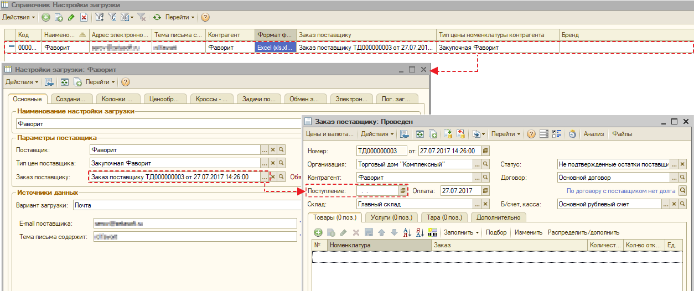

# Почему на сайте отображается неправильный срок доставки с Виртуального склада?

_Рассмотрим пример, когда позиция на Виртуальном складе доступна к доставке сегодня, но на сайте отображается срок доставки следующим днем._

**Срок доставки** отображаемый на сайте рассчитывается исходя из **даты** поставки, установленной в документе **«Заказ поставщику»**.

Таким образом, если срок поставки в документе **просроченная** на текущий момент **дата**, то согласно установленному механизму, система прибавляет +1 день к доставке, соответственно на сайт будет отображаться **«Срок доставки»** - завтра.


В связи с тем, что для заказов виртуального склада срок доставки не имеет смысла, рекомендуем **не устанавливать** в них **срок доставки** или **убрать** \(очистить данное поле\), если он есть.


