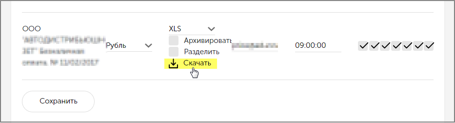

# Почему перестала работать отправка прайс-листа клиенту?

Прежде всего, необходимо проверить [**Настройки рассылки прайсов пользователю,**](https://help-zetaweb.zetasoft.ru/opisanie-i-nastroika/nastroika-rassylki-prais-listov#nachalnye-nastroiki-rassylki-prais-listov) не вносились ли там кем либо какие-то изменения, _например, в расписание._

Затем произвести проверку ручной выгрузки прайса в **личном кабинете пользователя** на сайте \(см.рисунок ниже\).

Произвести проверку **настроек пользователя сайта**, а именно какая **группа рассылки прайс листа** установлена. 

Таким образом, проанализировав **количество** попадающих в прайс записей, сверить поддерживает ли заданное количество записей установленный **формат** прайса.

На примере рисунка выше, при формировании прайса по такой группе _\(группа из трех складов\)_ в прайс попадает более 99 тыс. записей. При этом формат отправляемого прайса установлен **XLS**, который в максимуме поддерживает только 65256 записей, поэтому файл сохраниться не может, и соответственно, не отправляется.

В связи с чем, крайне рекомендуется использовать более современные форматы, например,  **XLSX** или **CSV**, в которых такого ограничения нет.  

