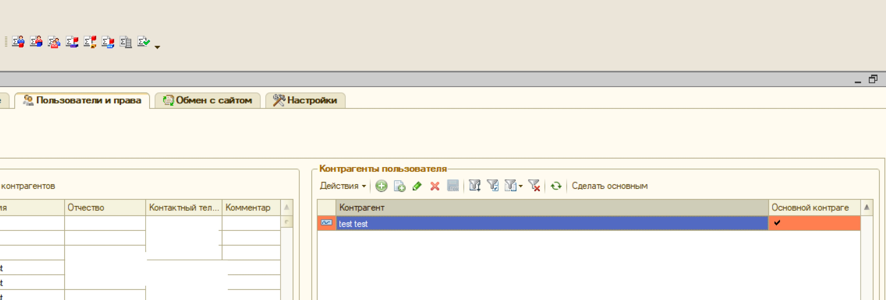
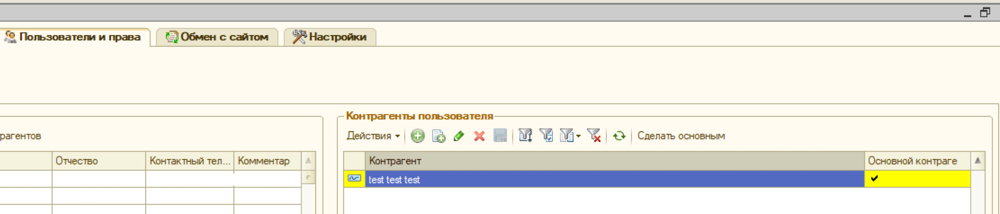

# Что означает подсветка строки контрагента пользователя в панели управления сайтом?

## Что означает подсветка строки контрагента пользователя в панели управления сайтом?

Начиная с версии продукта  2.4.8.3 от 26.10.2018,  для удобства пользователей, были внесены изменения в  отображении записей списка контрагентов.

Теперь в панели управления сайтом, в списке контрагентов пользователя сайта, добавлено цветовое кодирование строк:

* **Красным** подсвечиваются строки при ошибочной ситуации,если контрагент,основной договор или тип цен в договоре помечены на удаление.

* **Жёлтым** подсвечиваются строки с наличием потенциальной ошибки,когда у контрагента не указан  основной договор.

