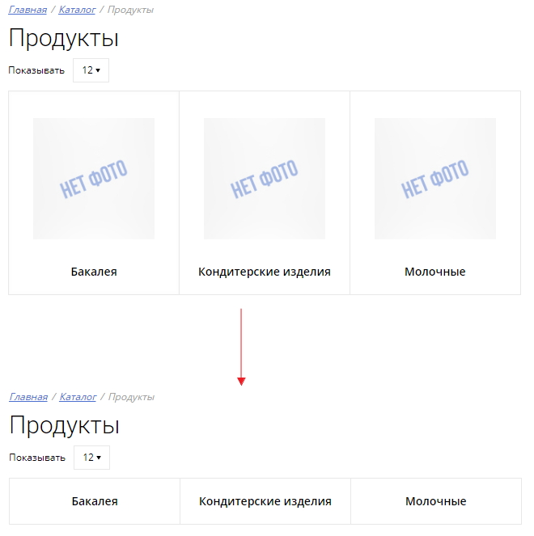
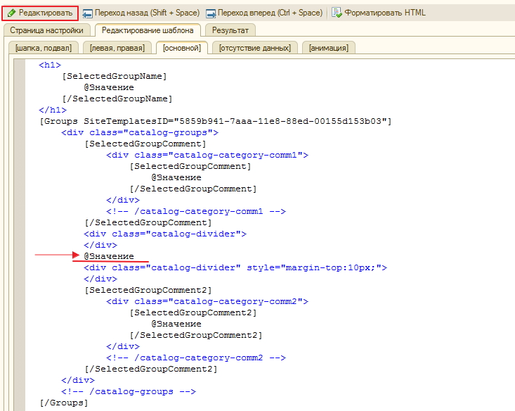

# Как изменить отображение группы каталога

Рассмотрим пример изменения отображения группы каталога с изображением на отображение группы без изображения.



1. Для контрола **Поиск. Группы каталога** создайте новый шаблон **Группы каталога. Без картинок.**&#x20;


В типовом дизайне при создании новых шаблонов используйте в наименовании название компании. Это позволит легко отличить собственные шаблоны от шаблонов типового дизайна. Например: Autoglobal. Группы каталога. Без картинок.



Вы можете создавать новые собственные шаблоны копированием типовых шаблонов. В этом случае для примера удалите часть разметки, которая отвечает за вывод изображения.


2\. Для контрола **Поиск. Каталог товаров.** создайте новый шаблон **Каталог. Группы без картинок.**


В типовом дизайне группы каталога имеют единственное отображение плиткой, а товары отображение как таблицей, так и плиткой. По-умолчанию используется отображение отображение товаров таблицей, по-этому для создания нового шаблона необходимо использовать шаблон  Каталог. Отображение товаров таблицей.


В шаблоне контрола **Поиск. Каталог товаров.** одновременно задается отображение группы каталога и товаров.

За отображение групп каталога отвечает часть \[Groups] , где SiteTemplatesID - id шаблона контрола **Поиск. Группы каталога.**&#x20;

```
[Groups SiteTemplatesID="5859b941-7aaa-11e8-88ed-00155d153b03"]
…
@Значение
…
[/Groups]
```

За отображение товаров в каталоге отвечает часть \[Products] , где SiteTemplatesID - id шаблона контрола **Поиск. Вывод результатов поиска.**&#x20;

```
[Products SiteTemplatesID="474634e3-9b86-11e6-94f1-00155d15e314"]
…
@Значение
…
[/Products]
```

Для изменения шаблона в \[Groups] установите курсор на @Значение и нажмите Редактировать.



Далее выбираете новый шаблон отображения группы каталога. Нажмите Выбрать -> Изменить -> Сохраните шаблон.

.png>)

3\. Чтобы установить новый шаблон для отображения группы каталога откройте вкладку Каталог в Панели управления сайтом. Выберите группу каталога, вызовите контекстное меню и выберите "Изменить".

.png>)

В поле «Шаблон отображения группы» задайте шаблон контрола **Поиск. Каталог товаров** созданный на этапе 2. Сохраните изменения.

.png>)


Важно! Если задать шаблон контрола **Поиск. Группы каталога** , то на странице Вы увидите ошибку **'groupname' not yet supported**.



Для вложенных групп каталога отображение остается по-умолчанию.&#x20;

