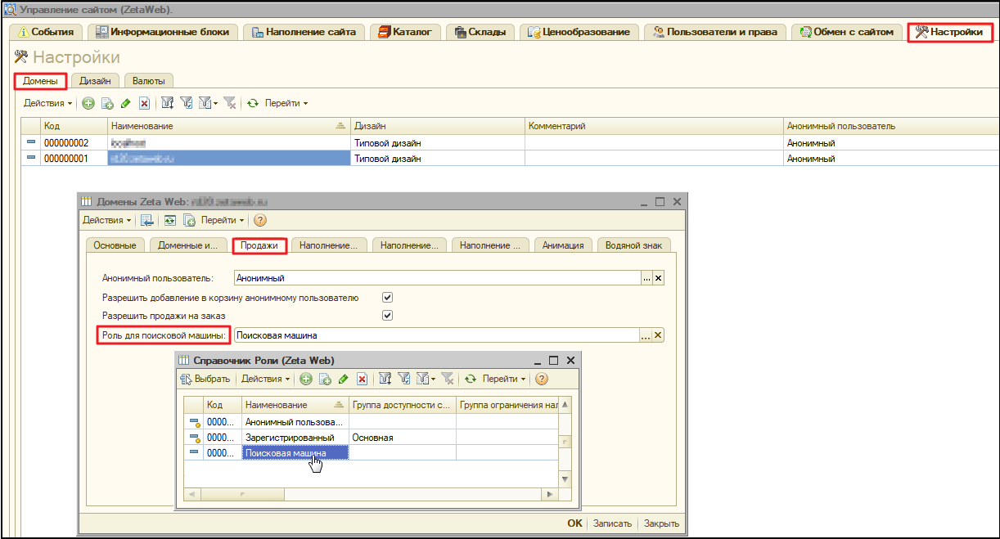

# Как изменять контент для роботов и других анонимных клиентов на сайте?

**Поисковые роботы \(**или **боты\)** — являются составной частью поисковой системы и предназначены для перебора страниц Интернета, с целью занесения информации о них в базу данных поисковика.

Определить бота можно по данным из **User Agent** - строке, которую используют веб-браузеры в качестве своего имени, содержащую не только имя браузера и другие параметры. 

Для работы с функционалом по замене контента для роботов и анонимных клиентов, в системе реализована возможность создавать для них отдельную **Роль**.

### Роль для поисковой машины

Для создания отдельной роли необходимо пройти по ссылке меню **Операции → Справочники → Роли \(Zeta Web\)**, нажать на **«Создать»** и задать ей необходимые права.

Далее следует установить роль для поисковой машины в **домене**. 

Для этого, перейдите в **Панель управления сайтом →** вкладка **Настройки →** вкладка **Домены** и откройте **домен**. В открывшейся форме, на вкладке **Продажи** перейдите к реквизиту **Роль для поисковой машины** и ****указать в нем ранее созданную роль.

### Справочник «Статистика посещений сайта: Боты \(Zeta Web\)»

Для того, чтобы перейти к настройкам функционала, перейдите по ссылке **Zeta Web → Настройки и администрирование → Служебная статистика → Статистика посещения сайта: Боты.**

В открывшемся окне справочника необходимо создать запись и внести данные настроек поискового бота, а именно, заполнить поля:

* **Наименование**;
* **Поисковая машина** _\(выбрать из справочника "Статистика поисковых машин \(Zeta Web\)"\)_;
* **Маска поиска в UserAgent** _\(указать шаблон поискового запроса\)._

_На рисунке ниже представлен пример настройки для всех ботов Yandex._

Так, например,  **%** _**\(процент\)**_ в строке маски поиска**,** на рисунке выше, обозначает поиск по вхождению. Таким образом, в соответствии с информацией, указанной в ****поле **UserAgent**_,_ данный запрос будет идентифицирован, как запрос от бота и ему будет назначена роль, указанная в домене.


 **Обратите внимание!**

На рисунке 2, наглядно продемонстрирован пример, как в процессе создания роли для поисковой машины, **настройки провайдеров** \(вкладка **Дополнительно**\) оставлены пустыми.

В таком случае, данные провайдера будут взяты из **настроек контролов поиска**.

В связи с чем, для того, чтобы исключить напрасную трату запросов, следует и в контролах поиска также оставить **настройку провайдера TecDoc** пустой. 


Таким образом, реализована возможность менять контент, например, скрывая его правами доступа для заданной роли.

