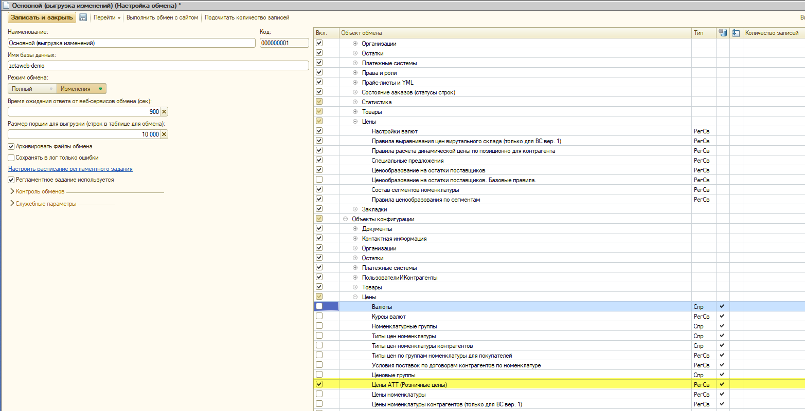
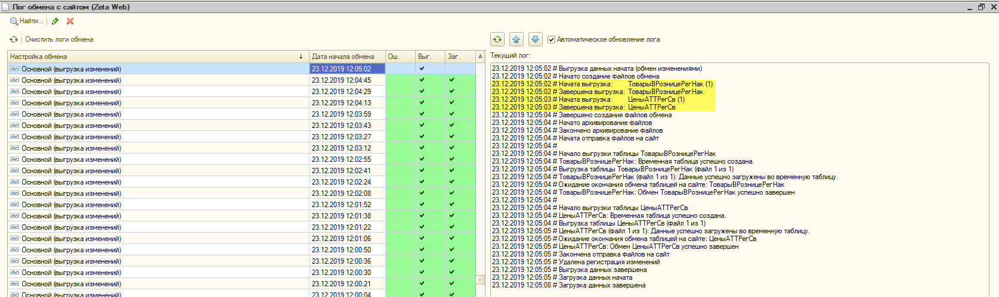

# Как проверить, что изменение цены документом "Переоценка товаров в рознице" выгрузилось на сайт?

Проконтролировать выгрузку изменений цен, документом _**"Переоценка товаров в рознице"**_, Вы можете в логе обмена:

1\) Пройдите по ссылке меню **Zeta Web → Обмены** и выберите обмен.\
2\) Проверьте наличие флага на объекте конфигурации **Цены АТТ (Розничные цены)**.

3\) Откройте лог обмена и найдите в тексте строки, выделенные на скриншоте ниже.

Данный текст свидетельствует о том, что изменения цен были успешно выгружены на сайт.


Если Вы являетесь 1С специалистом и Вас интересует **текст запроса**, в выбранном обмене Вам следует дважды кликнуть мышью на объект конфигурации _ **Цены АТТ (Розничные цены)**_**,** а затем, в открывшемся окне, дважды кликнуть мышью на _**вид конфигурации**_ - после чего, произойдет открытие окна запроса.

