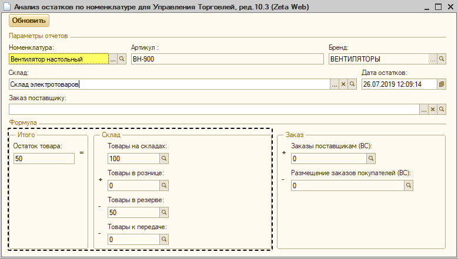
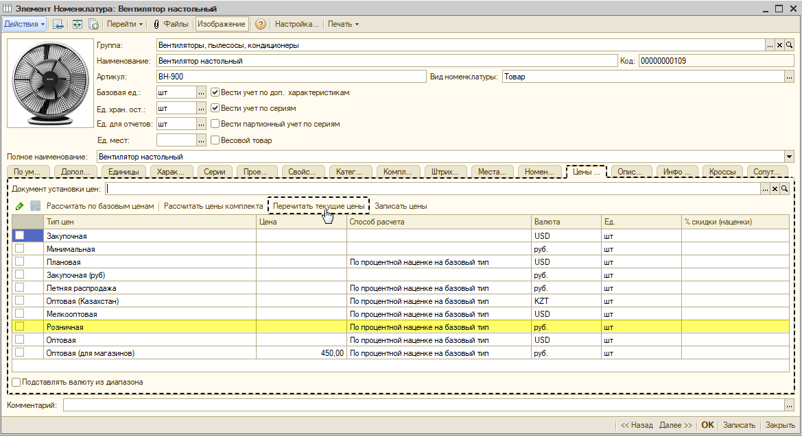
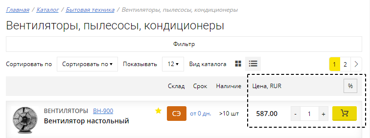

# Почему при наличии товара на складе, отсутствует возможность ее покупки на сайте?

Наиболее частыми причинами невозможности добавления товара в заказ являются:

1. отсутствие наличия остатков на складах;
2. ошибки в настройках [группы доступности складов](https://help-zetaweb.zetasoft.ru/opisanie-i-nastroika/sklady-i-postavshiki/gruppy-dostupnosti-skladov);
3. некорректная установка [ценообразования ](https://help-zetaweb.zetasoft.ru/opisanie-i-nastroika/cenoobrazovanie)на товары.

_Рассмотрим решение данного вопроса на следующем примере:_ 

Из рисунка ниже следует, что на сайте, у позиции **«Вентилятор настольный ВН-900»** отображается информация о ее наличии **на собственном складу**, но отсутствует цена и возможность приобретения.

Прежде  всего, произведем проверку остатков по товару через **Zeta Web** → **Каталог и товары** → **Анализ остатков по номенклатуре,** установив в **параметрах отчета** искомую номенклатуру.

Далее, согласно [инструкции](https://help-zetaweb.zetasoft.ru/opisanie-i-nastroika/sklady-i-postavshiki/gruppy-dostupnosti-skladov), убедимся, что позиция на складе для соответствующего пользователя сайта доступна для приобретения.

Из рисунка выше следует, что флаг в графе **"Только просмотр"** отсутствует, а значит товар на сайте доступен **не** только для чтения.

В заключение, проверим корректность установки цен номенклатуры для искомой позиции на сайте. 


Обратите внимание, что в текущем примере рассмотрен **расчетный** вид типа цен. Ознакомьтесь с [инструкцией ](https://help-zetaweb.zetasoft.ru/opisanie-i-nastroika/cenoobrazovanie/dlya-1s-upravlenie-torgovlei-red.-10.3)для проверки механизма вашего ценообразования.


Далее необходимо проверить в договоре контрагента на вкладке **"Дополнительно"** установленное значение **"Тип цен".**

Затем, т.к. товар указан в наличии на собственном складу, следует перейти в **Справочник → Номенклатура → Номенклатура**, открыть необходимую позицию и на вкладке **"Цены номенклатуры"** проверить наличие цены в типе цен, указанном в договоре контрагента _\(либо проверить наличие цены через нажатие в верхней строке меню на **Перейти → Цены номенклатуры**\)._

Таким образом, из рисунка выше следует, что для искомой номенклатуры не указана **цена**, в связи с чем и отсутствует возможность ее приобретения на сайте.

Необходимо создать соответствующий документ **«Установка цен номенклатуры»,** пересчитать текущие цены в номенклатуре и произвести обмен с сайтом.

При обновлении страницы сайта, видим, что позиция стала доступна к заказу.

