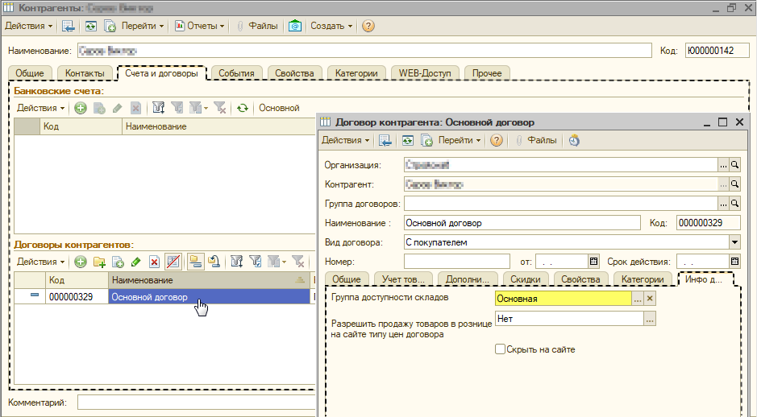

# Почему при наличии товара на складе, отсутствует возможность ее покупки на сайте?

_Рассмотрим решение данного вопроса на следующем примере:_

Из рисунка ниже следует, что на сайте, у позиции **«Вентилятор настольный ВН-900»** отображается информация о ее наличии на складе, но отсутствует цена и возможность приобретения.

1\) Прежде  всего, необходимо удостовериться в наличии остатков на складах.

Произвести проверку остатков можно через **Zeta Web** → **Каталог и товары** → **Анализ остатков по номенклатуре,** установив в **параметрах отчета** искомую номенклатуру.

2\) Следует убедиться, что позиция на складе для соответствующего пользователя сайта доступна для приобретения.

Для этого, необходимо открыть **Управление сайтом → Пользователи и права** и выбрать пользователя.

Перейти в **Контрагенты пользователя** и открыть договор контрагента на вкладке **"Счета и договоры".**   
  
В договоре контрагента на вкладке **"Инфо для сайта"** проверить значение **"Группа доступности складов"**.

Далее открыть **"Группы доступности складов \(Zeta Web\)"** и удостовериться в отсутствии флага в графе **"Только просмотр"** _\(при установке данного флага - позиция на сайте доступна только для чтения\)._

3\) Проверить корректность установки цен номенклатуры для искомой позиции на сайте.

Открыть **Управление сайтом - Пользователи и права** и найти соответствующего пользователя;

Перейти в **Контрагенты пользователя** и открыть договор контрагента на вкладке **"Счета и договоры".** 

В договоре контрагента на вкладке **"Дополнительно"** проверить установленное значение **"Тип цен".**

Далее требуется перейти в **Справочник → Номенклатура → Номенклатура** и открыть необходимую  позицию. На вкладке **"Цены номенклатуры"** проверить наличие цены в типе цен указанном в договоре контрагента _\(либо проверить наличие цен через нажатие в верхней строке меню на **Перейти → Цены номенклатуры**\)._

Таким образом, из рисунка выше следует, что для искомой номенклатуры не указана **цена**, в связи с чем и отсутствует возможность ее приобретения на сайте.

Необходимо создать соответствующий документ **«Установка цен номенклатуры»,** пересчитать текущие цены в номенклатуре и произвести обмен с сайтом.

При обновлении страницы сайта видим, что позиция стала доступна к заказу.

