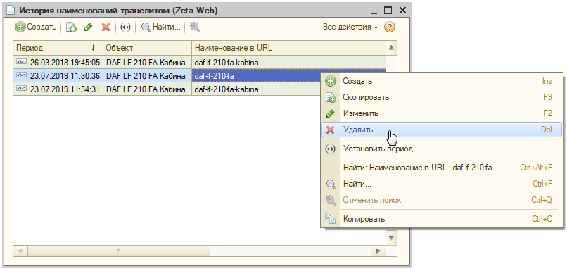

# Почему в товаре не отображается картинка или показывается неправильное изображение?

Причинами не отображения картинки у товара на сайте, или отображения некорректной картинки, могут являться следующие условия:

* Изображение не выгружено на сайт;
* Неправильный формат изображения, например pdf и т.п.;
* Имеются не уникальные наименования в URL для двух и более изображений;
* В истории изменения наименования URL присутствует запись о присвоении одинакового URL для двух и более изображений.

#### Рассмотрим решение данного вопроса на следующем примере:

На сайте некорректно отображается изображение кабины **автомобиля DAF LF 210 FA**, вместо это возник дубль основного изображения автомобиля.

Прежде всего необходимо открыть данную позицию в справочнике номенклатуры в 1С **Справочники → Номенклатура → Номенклатура** и проверить наличие изображения в **«Файлах»**.

Из рисунка выше следует, что файл с изображением корректно подгружен в соответствующую позицию номенклатуры. 

Далее требуется открыть изображение, которое не отображается на сайте или отображается некорректно, и проверить уникальность, присвоенного ему **«Наименование в URL»**. 


_Произвести данную проверку можно также пройдя по ссылке меню **Операции → Справочник → Хранилище дополнительной информации** и настроив фильтр по соответствующей номенклатуре._


Как видим, у изображения с кабиной автомобиля поле **«Наименование в URL»** идентично основному изображению автомобиля, что является некорректным!

Сгенерировав новое **«Наименование в URL»** для кабины автомобиля, производим запись номенклатуры.

Затем также необходимо проверить уникальность наименования URL соответствующего файла, пройдя по ссылке меню **Операции → Справочник → Картинки \(Zeta Web\)**. При обнаружении одинакового URL для двух и более изображений, также внести корректировки аналогично описанию абзацем ранее.

Далее требуется открыть **Операции → Регистр сведений → История наименований транслитом**, найти соответствующий объект и удалить из его истории строку с установкой не уникального наименования URL.

В заключение требуется произвести обмен с сайтом и проверить отображение картинки на сайте.

На сайте отобразилось корректное изображение кабины автомобиля.

