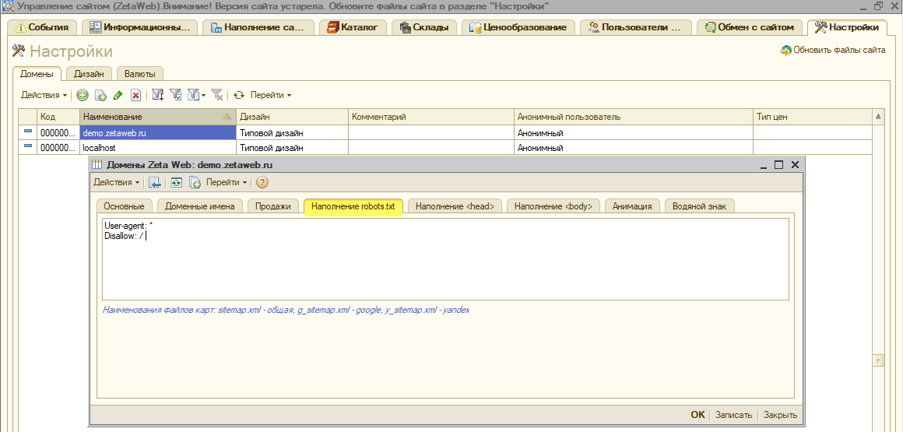

# Почему в товаре показывается неправильное изображение?

При возникновении проблемы с некорректным отображением картинки в карточке товара на сайте необходимо:

1. Проверить наличие картинки в **файлах** соответствующей номенклатуры;
2. Проверить уникальность значения **«Наименование в URL»** каждого из изображений;
3. Проверить корректность формирования записей в регистре **«Истории наименований транслитом».**

#### Рассмотрим решение данного вопроса на следующем примере:

На сайте некорректно отображается изображение кабины **автомобиля DAF LF 210 FA**, вместо это возник дубль основного изображения автомобиля.

Прежде всего необходимо открыть данную позицию в справочнике номенклатуры в 1С и проверить наличие изображения в **«Файлах»**.

Из рисунка выше следует, что файл с изображением корректно подгружен в соответствующую позицию номенклатуры. 

Далее требуется открыть изображения и проверить уникальность, присвоенного каждому из них, **«Наименование в URL»**. 


Произвести данную проверку можно также пройдя по ссылке меню **Операции → Справочник → Хранилище дополнительной информации** и настроив фильтр по соответствующей номенклатуре.


Как видим, у изображения с кабиной автомобиля поле **«Наименование в URL»** идентично основному изображению автомобиля, в связи с чем, при обращении сайта к хранилищу выгружалась некорректная картинка \(_а именно, наименование к которой было присвоено раньше\)_. 

Установив уникальное **«Наименование в URL»** для кабины автомобиля, производим запись номенклатуры и обмен в сайтом.

Также рекомендуется пройти по ссылке меню **Операции → Регистр сведений → История наименований транслитом** и проверить корректность формирования истории записи изменений.


_В отдельных случаях, когда последняя запись в истории изменений по прежнему указывает на "старый URL" - следует удалить данную строку._


Таким образом, из регистра следует, что запись о присвоении нового **наименования в URL** зафиксировано и следует повторно проверить корректность отображения картинки на сайте.

На сайте отобразилось корректное изображение кабины автомобиля.

