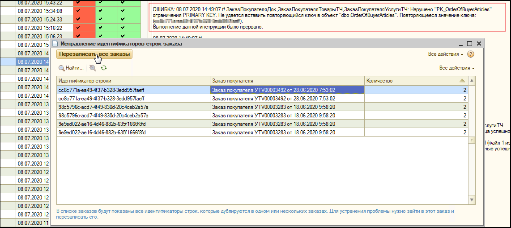

# Ошибка ограничения PRIMARY KEY. Повторяющееся значение ключа.

### ОШИБКА: __\# ЗаказПокупателяДок, ЗаказПокупателяТоварыТЧ, ЗаказПокупателяУслугиТЧ: Нарушено "PK\_OrderOfBuyerArticles" ограничения PRIMARY KEY. Не удается вставить повторяющийся ключ в объект "dbo.OrderOfBuyerArticles". Повторяющееся значение ключа.

В случае обнаружения в логе обмена изменениями данной ошибки необходимо открыть **ZetaWeb → Настройки и администрирование → Исправление идентификатором строк заказа** и нажать **"Перезаписать все заказы".**

_Пример ошибки и процесс ее решения наглядно проиллюстрирован на рисунке ниже._

