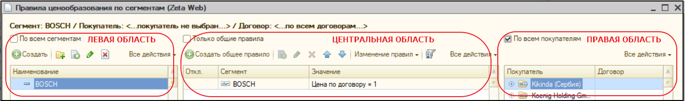
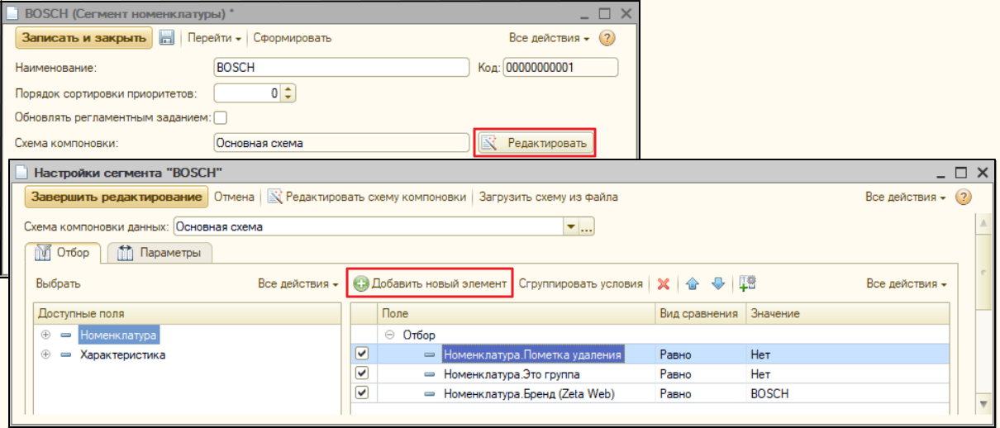
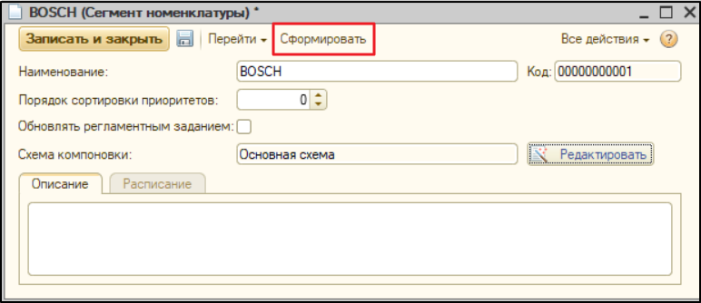

# Ценообразование по сегментам номенклатуры

Ценообразование по сегментам номенклатуры является дополнительным функционалом, расширяющим стандартные возможности 1С "Управление торговлей" ред. 10.3, с помощью разнесения номенклатуры по произвольным признакам к какому-либо сегменту, определенному пользователем.

### Для создания **нового правила ценообразования по сегментам** необходимо:

1. Создать или выбрать **сегмент номенклатуры**.
2. Настроить **схему отбора номенклатуры**, которая принадлежит этому сегменту.
3. Создать новое **правило ценообразования**.

Для создания нового правила перейдем в форму регистра сведений, расположенную в меню **Zeta Web → Панель управления "Настройки"→  Цены → Настройка правил ценообразования по сегментам**.

Рабочая область функционала разделена на три части:

* **левая область** - список всех сегментов (там же и создаем новые);
* **центральная** - список правил для выбранного сегмента;
* **правая** - список контрагентов, для кого может быть применено правило.

### **Создание нового сегмента**

Для создания нового сегмента в левой области формы нажимаем кнопку **"Создать",** откроется форма создания нового элемента.

.png>)

Присваиваем сегменту **Наименование** и, при необходимости, заполняем **Описание** - памятку, что входит в данный сегмент.


_**Сортировка приоритетов** нужна для создания иерархии внутри списка сегментов. Это полезно в ситуациях, если одна номенклатура попала в несколько сегментов._\
_В случае, когда одна номенклатура попала в несколько сегментов, к ней применяется правило сегмента с более высоким приоритетом._


Далее настраиваем **отбор номенклатуры** - на основании него заполняется регистр "**Состав сегментов номенклатуры**", который содержит сегмент, номенклатуру и характеристику.

В открытой форме добавляем **условия**, по которым мы будем наполнять наш регистр. \
Отбор строится с помощью стандартной схемы компоновки:

После установки отборов, завершаем редактирование.

По нажатию кнопки "**Сформировать**" происходит заполнение регистра, согласно выбранным отборам.

Для автоматического последующего отнесения новой номенклатуры к нужному сегменту настроим **регламентное задание**:

Теперь наш сегмент будет обновляться автоматически.

Кроме того, если необходимо - указываем **порядок** в сортировке приоритетов.

### Создание нового правила ценообразования

В форме списка регистра сведений "Правила ценообразования по сегментам" выбираем созданный нами сегмент и формируем для него **правило**.

Правила бывают двух типов:

1. **Общие;**
2. **Для конкретного контрагента или договора.**

Если мы хотим создать **общее правило**, которое будет работать для всех наших клиентов, то в центральной части экрана нажимаем на кнопку **"Создать общее правило"**.

В открывшейся форме устанавливаем **приоритет** правила, а также сам **принцип ценообразования:**

* _**"Процент скидки (наценки)"**_\
  _****_При выборе этого правила пользователь задает наценку или скидку на позиции номенклатуры сегмента.\
  В поле "Скидка (наценка) в %" указываем числовое значение в процентах. \
  ****Скидка указывается положительным числом, наценка - отрицательным.
* _**"Фиксированная цена"**_\
  _****_Задание фиксированной цены для всей номенклатуры, попавшей в сегмент.
* _**"Сумма наценки скидки"**_\
  _****_К стоимости позиции прибавляется (убавляется) фиксированная сумма скидки (наценки).
* _**"Сначала отнять сумму, потом процент"**_\
  _****_От стоимости позиции вычитается сумма скидки (наценки), после чего к полученному числу применяется процент.
* _**"Сначала отнять процент, потом сумму"**_\
  _****_От стоимости позиции вычитается процент скидки (наценки), после чего к полученному числу применяется число из поля "Сумма".


**Важно!** Цена и сумма указываются в валюте управленческого учета.


#### **Алгоритм создания частного правила для конкретного договора или контрагента**

Создание такого правила немного отличается от создания общего правила.

Кнопка **"Создать правило по покупателю (договору)"** позволяет создать правило для активного элемента списка. \
Для формирования правила сразу для нескольких контрагентов можно настроить список и выбрать команду из меню **Все действия →Создать / сортировать правила.**

.png>)


_**Важно!** _ \
_На форме имеются флаги отображения **"По всем сегментам", "Только общие правила", "По всем покупателям"**, которые помогают отображать правила с различными фильтрами. Выбранная настройка отображается сверху в строке жирным шрифтом._


#### Видеопример настройки ценообразования по сегментам




_**Важно!** _ \
_Для применения дополнительного ценообразования на сайте в **настройках обмена** с сайтом в разделе "**Объекты Zeta Web - Настройки - Цены**" должны быть включены объекты обмена:_\
_**- Состав сегментов номенклатуры**_\
_**- Правила ценообразования по сегментам.**_

