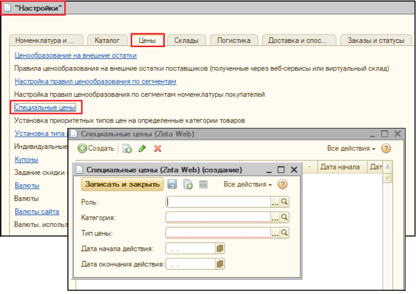

# Специальные цены

## Zeta Web. Специальные цены


Механизм спеццен позволяет установить на выбранную номенклатуры определенный тип цен для всех клиентов. Данная цена будет применяться в заданный интервал дат всем без исключения клиентам вне зависимости от установленного в договоре типа цен.

Данный функционал является дополнительным к штатному ценообразованию базовой конфигурации.


Для доступа к функционалу следует пройти по ссылке меню **Zeta Web → Панель управления "Настройки"→  Цены → Специальные цены.**



