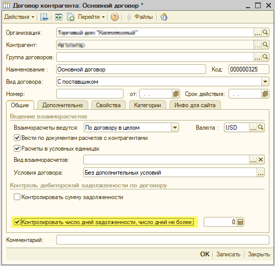

# Состояние счета

### Глубина дней задолженности

Данное значение формируется из количества дней, указанных в договоре контрагента на вкладке **Общие** , при установке флага **"Контролировать число дней задолженности,число дней не более"**.

### Договор контрагента

Указывается наименование основного договора, по которому ведутся взаиморасчеты.

### Доступная сумма

Данное значение формируется из суммы **Предоплаты,** т.е. если оплата по заказу была произведена, а товар не был отгружен.

### Кредитный лимит

Данное значение формируется из соответствующего договора по взаиморасчетам с контрагентом.

### Минимальный процент предоплаты по договору

Данное значение устанавливается в соответствии с договором по взаиморасчетам с контрагентом.

### Осталось дней до просрочки 

Данное значение формируется исходя из количества дней, заданных в договоре контрагента.

### Просрочено дней

Данное значение формируется исходя из количества дней, заданных в договоре контрагента.

### Сумма долга за резервы \(если резервы включены в долг\)

?

### Сумма долга

?

### Сумма корзины для текущего договора

Данное значение формируется из итоговой суммы товаров в корзине для выбранного договора.

### Сумма предоплаты

Данная сумма формируется, если оплата по заказу была произведена, но товар еще не отгружен.

### Сумма резервов \(если резервы не включены в долг\)

?

