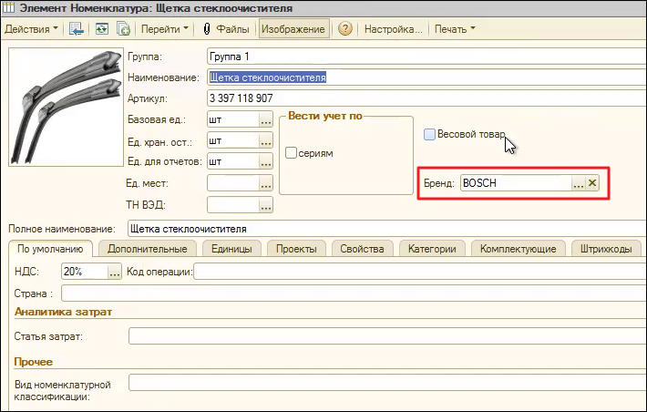

# Бренды

В структуре Zeta Web **Бренд** является реквизитом номенклатуры и отдельным справочником.


Бренды особенно актуальны для направлений торговли, в которых для определения уникальности номенклатуры недостаточно только **артикула**.&#x20;

Одно из таких направлений - **продажа запчастей.**



В Zeta Web по умолчанию уникальность номенклатуры определяется связкой **Очищенный артикул + Бренд**


## Дубли номенклатуры

При работе с большим количеством номенклатуры и взаимодействии с поставщиками (или загрузке номенклатуры из разных источников) встречаются дубли номенклатуры.


В системе Zeta Web уникальность номенклатуры проверяется при создании.&#x20;

Если уже существует номенклатура с таким **Очищенным артикулом** и **Брендом**, то при записи будет соответствующее предупреждение.

**Если бренд не указан, то контроль уникальности номенклатуры не действует.**


Обычно Zeta Web внедряется в 1С, в которой уже есть созданная номенклатура и не ведется контроля дублей. Поэтому в базе может быть несколько дублей одной позиции.


Самая распространенная причина дублей в запчастях: ****&#x20;

_**использование разных названий одного и того же Бренда.**_


## Отображение дубля на сайте

 (1).png>)

.png>)

## Работа с дублями


Подход к обработке номенклатуры, свертке или удалению дублей зависит от сложности учета и состояния базы 1С. Для больших и старых баз это может оказаться сложной задачей.


_Далее рассмотрены несколько основных методов._

### Свертка дублей

В зависимости от конфигурации для поиска и замены дублирующихся элементов используются различные обработки.&#x20;

_Мы рассмотрим на примере штатной обработки 1С Управление торговлей 10.3._

.png>)

.png>)

Для обработки номенклатуры выберите:

* _**Справочник**_
* _**Реквизит поиска**_
* _**Режим поиска**_

а также задайте _**Настройку уровня сходства слов**_** ** (актуально для поиска дублей по наименованию).

Также можно задать дополнительные отборы (например, выбрать только определенную группу номенклатуры).

.png>)

После выбора параметров нажмите на кнопку **"Найти дубли".**

Для управления отображаемыми реквизитами в результатах воспользуйтесь настройкой **Видимые колонки.**

.png>)

В нашем примере, мы добавили **Бренд** и убрали **Объект**.

.png>)

Далее в каждой выбранной группе необходимо выбрать **Правильный элемент**, если это действительно дубли.&#x20;

_На примере скриншота выше, мы видим не дубли, а действительно разные номенклатурные позиции._

.png>)

А это уже пример дубля. Для того, чтобы его свернуть, нам необходимо указать одну из позиций как правильную и выполнить замену.

.png>)

После этого в базе останется только правильный элемент и все ссылки на дубли будут заменены на него.

Аналогичную операцию по поиску и замене дублей мы можем проделать и с другими справочниками, например с Брендами.


Будьте внимательны при свертке дублей брендов, т.к. переименовав и свернув дубли брендов можно получить дубли номенклатуры по связке Очищенный артикул + Бренд.



Обязательно согласовывайте операции по свертке дублей с квалифицированными 1С-специалистами и руководством.


**Не всегда можно свернуть дубли безболезненно для учетной системы.**

Например, в системе есть дубли номенклатуры:

1. WA940/9, MANN, Фильтр охлаждающей жидкости
2. WA940/9, MANN-FILTER, Фильтр охлаждающей жидкости VOLVO BUS 5000, 7000, 8000, 9000, B6, B7, B9, B10, B12, B13, C10M

.png>)

И каждая из этих позиций номенклатуры участвовала в документах, находящихся в закрытых периодах, в которых уже нельзя вносить изменения. В этом случае не получится использовать свертку дублей и в системе остается дубль.

Для решения таких ситуаций разработана методика по перекроссировке брендов.

## Перекроссировки брендов
