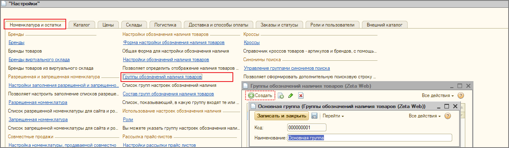

# Перекроссировки брендов

Zeta Web позволяет создавать перекросировки между собственными брендами, выбирая основной бренд, а также привязывать свои бренды к нужным эталонным брендам WSG.

## Термины и определения

Про собственные бренды есть соответствующий раздел - [бренды](brendy.md).


**"Одобрен" и "Не одобрен"** - носит информационный характер, влияет на подсветку брендов в табличной части обработки "Работа с дублями брендов". По умолчанию у всех брендов установлено значение "Не одобрен".

Одобренные бренды подсвечиваются зеленым цветом.



**Основной бренд** - признак бренда \(флаг\), определяющий, что к данному бренду будут приводиться другие бренды.



**Эталонные бренды WSG** получаются из [Zeta Веб-сервисы](https://www.zetasoft.ru/products-zeta-webservices/) \(WSG\) и являются дополнительным реквизитом у бренда.

Эталонные бренды используются для:

* связи собственной номенклатуры с предложениями, полученными из веб-сервисов поставщиков через Zeta Веб-сервисы;
* помощи в перекроссировке собственных брендов с учетом уже созданных в WSG перекроссировок.

"id бренда WSG" - служебный параметр, хранится для сопоставления с эталонным брендом WSG.


## Обработка "Работа с дублями брендов"

Обработка для работы с дублями брендов доступна из формы справочника Бренды.

### Шапка

В шапке находятся кнопки для управления, групповых операций и работе с WSG.


При большом количестве номенклатуры в 1С выполнение групповых операций может занимать продолжительное время.


#### Групповые операции

* Обновить количество номенклатуры - подсчитывает и проставляет количество номенклатуры по каждому бренду.
* Переместить все необработанные бренды в основные бренды. Этой групповой операцией есть смысл воспользоваться в том случае, когда в необработанных брендах нет дублей.
* Переместить все основные бренды без эталонного и кроссов в необработанные бренды. Этой групповой операцией можно воспользоваться для того, чтобы вернуть все бренды, по которым нет привязки к эталонным брендом и не добавлены кроссы.

#### Групповые операции WSG

* Подобрать эталонные бренды WSG - проверяет бренды через Zeta Веб-сервисы и заполняет реквизит "Эталонный бренд WSG" и "id бренда WSG" \(служебный реквизиты\).
* Одобрить бренды с эталонными названиями WSG - у всех брендов, которые точно совпали с названиями эталонных брендов WSG, будет установлен флаг "Одобрен" \(по умолчанию у всех брендов установлено значение "Не одобрен"\).
* Заполнить основные бренды по эталонным брендам WSG - переносит все бренды в основные бренды и кроссы к ним, у которых подобрался эталонный бренд WSG.

### Левая область

В левой области находятся список необработанных брендов и список номенклатуры по выбранному бренду.

А также строка для поиска бренда.


При установленном флаге "Автоотбор" при выбора любого бренда в списке необработанных брендов будет автоматически происходить поиск по первым трём символам в списке основных брендов.


### Правая область

В правой области находится список основных брендов, а так же кроссы, которые отображаются при выборе бренда.


При установленном флаге "Автоотбор" при выбора любого бренда в списке основных брендов будет автоматически происходить поиск по первым трём символам в списке необработанных брендов.


## Порядок действий по обработке брендов

Мы рекомендуем следующую методику по начальной обработке брендов.

### Обновить количество номенклатуры

В групповых операциях выберите "Обновить количество номенклатуры". После выполнения операции рядом с каждым брендом появится количество номенклатуры в 1С с соответствующим брендом.

### Подобрать эталонные бренды WSG

Следующий этап - подбор эталонных брендов WSG. Zeta Веб-сервисы \(WSG\) имеет свою базу перекроссировок, на основании которых и происходит подбор.

Для этого нажмите "Подобрать эталонные бренды" в выпадающем списке WSG.

О начале и окончании операции будут соответствующие служебные сообщения.

В результате у всех брендов, которые были найдены в WSG, будут заполнены эталонные бренды WSG.

### Одобрить бренды с эталонными названиями WSG

Следующим этапом мы рекомендуем одобрить все бренды, у которых название в точности совпало с названием эталонного бренда WSG. Для этого нажмите "Одобрить бренды с эталонными названиями WSG" в выпадающем списке WSG.

После выполнения операции все одобренные бренды будут подсвечены зеленым цветом.

### Заполнить основные бренды по эталонным брендам WSG

После этого мы рекомендуем перенести все бренды, у которых подобрался эталонный бренд WSG в список основных брендов \(т.е. у этих брендов будет проставлен флаг "Основной бренд"\).


Если несколько брендов соответствуют одному эталонному бренду WSG, то при переносе основным брендом будет сделан первый попавшийся бренд, а остальные будут добавлены в кроссы к этому основному бренду.


Для выполнения операции в списке WSG выберите пункт "Заполнить основные бренды по эталонным брендам WSG".

После заполнения основных брендов рекомендуется просмотреть все основные бренды с кроссами. Для этого сделайте сортировку по колонке "Кол. кр. бр." и перейдите в начало списка.


Основные бренды, на которые созданы перекроссировки, выделены жирным, а также у них проставлено количество кроссов.


### Изменение основного бренда

По каждому выбранному основному бренду отображаются привязанные перекроссировки.

#### Переименование бренда

Если основной бренд подобрался верно, но мы хотим изменить его наименование, то для этого необходимо открыть нужный бренд, нажав на него два раза, изменить наименование и нажать "Записать и закрыть".

#### Изменение основного бренда

Если необходимо изменить основной бренд и кроссировки, то необходимо:

* Удалить все перекроссировки для выбранного основного бренда. Для выделения всех кросс-брендов нажмите Ctrl + A в списке кросс-брендов, после чего нажмите Delete для удаления и подтвердите действие.

* После этого все бренды из списка кросс-брендов по этому основному бренду перейдут в список необработанных брендов.
* Откройте нужный основного бренда и снимите флаг "Основной бренд". После этого он также перейдет в список необработанных брендов.
* Выберите нужный необработанный бренд и нажмите "Переместить в основные бренды"

* Создайте перекроссировки на выбранный основной бренд. Для этого выберите нужный бренд в необработанных и нажмите "Переместить в кросс-бренды". При этом обращайте внимание на выбранный основной бренд, т.к. перекроссировка будет создана на него.

В результате получим новый основной бренд с перекроссировками.

### Обработка оставшихся брендов

Заключительный этап - обработка брендов, которые не подобрались через WSG. Порядок действий примерно следующий:

* Просматриваем список, видим бренд, который называется некорректно \(на этом этапе рекомендуем включить "Автоотбор" в необработанных брендах\).

* При включенном флаге "Автоотбор" и выборе бренда "BAW \(JASON CO., LTD.\)" в основных брендах будет отобран бренд "BAW".

* Если мы понимаем, что это кросс-бренд, то нажимаем "Переместить в кросс-бренды", предварительно выбрав основной бренд.
* Также в процессе мы можем переименовать или пометить бренд на удаление.


При установке пометки на удаление обращайте внимание на наличие номенклатуры, которая участвовала в движениях. Т.к. при наличии ссылок на нее в документах 1С не даст просто удалить ее.


* В результате в необработанных останутся только те бренды, наименования которых мы считаем правильными. Их мы можем либо переносить в основные каждый в ручном режиме, либо воспользоваться соответствующей групповой операцией. 

