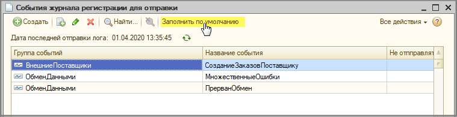
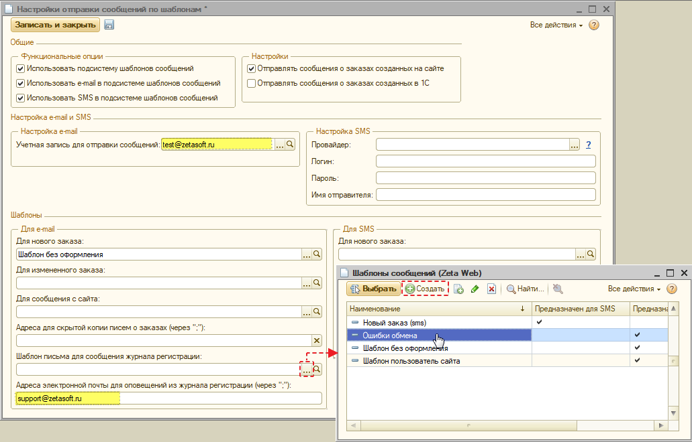
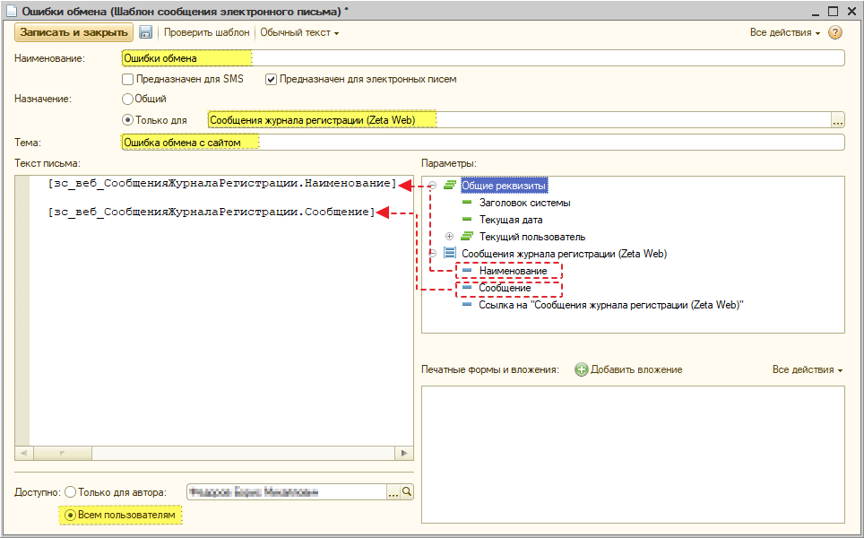
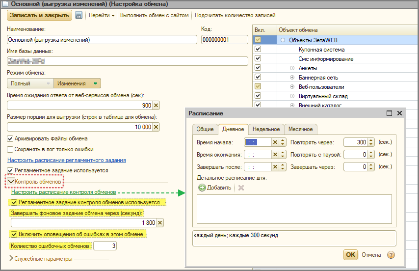

# Уведомления (e-mail, SMS-сообщения)

В Zeta Web реализовано 2 механизма отправки оповещений:

1. **Отправка осуществляется веб-частью Zeta Web;**
2. **Отправка происходит из 1С.**

## Отправляет веб-часть Zeta Web

### Регистрация нового пользователя

За отправку уведомлений о регистрации отвечает контрол [Регистрация нового веб-пользователя (v2)](https://help-zetaweb.zetasoft.ru/tekhnicheskaya-dokumentaciya/opisanie-kontrolov/2-pokupateli/avtorizaciya-\_-registraciya/registraciya-novogo-veb-polzovatelya-v2).

Для настройки уведомлений, необходимо в контроле, который добавлен на страницу регистрации, настроить:

1. **Заголовок;**
2. **Учетную запись;**
3. **Шаблон текста.**

Рассмотрим на примере регистрации физ. лица и реализации в типовом дизайне. \
На странице **Регистрация** добавлены 2 контрола регистрации: один для физ. лиц, второй для юр. лиц. \
\
Произведем настройку для физ. лиц:\
\
**-** Открываем страницу, выбираем первый контрол регистрации и нажимаем "Редактировать";

 (1).png>)

**-** Заполняем необходимые поля;

.png>)

* Пример шаблона письма уведомления о регистрации:

```markup
<p>
	Вы зарегистрировались на сайте demo.zetaweb.ru.
</p>
<p>
	Ваш логин:&nbsp;
		[UserEmail]
			@Значение
		[/UserEmail]
</p>
<p>
	Ваш пароль:&nbsp;
		[UserPassword]
			@Значение
		[/UserPassword]
</p>
<p>
	Ваши вопросы и пожелания смело отправляйте на info@zetasoft.ru
</p>
<p>
	--
	<br />
	С уважением,
	<br />
	команда Zeta Web
</p>
```

* Сохраняем изменения и выполняем обмен с сайтом;
* В результате, после регистрации на почту приходит письмо.

.png>)

### Восстановление пароля

За отправку сообщений о восстановлении пароля отвечает контрол [Восстановление пароля](https://help-zetaweb.zetasoft.ru/tekhnicheskaya-dokumentaciya/opisanie-kontrolov/2-pokupateli/avtorizaciya-\_-registraciya/vosstanovlenie-parolya).&#x20;

Для настройки уведомлений необходимо в контроле, который добавлен на страницу регистрации, настроить:

1. **Заголовок;**
2. **Учетную запись;**
3. **Шаблон текста.**

Рассмотрим на примере реализации в типовом дизайне. На странице **Восстановление пароля** добавлен контрол восстановления пароля.

**-** Открываем страницу, выбираем первый контрол восстановления пароля, нажимаем редактировать и заполняем необходимые поля;

.png>)

**-** Пример шаблона письма о восстановлении пароля:

```markup
<p>
	Здравствуйте,
	[UserName]
		@Значение
	[/UserName]
	[UserLastName]
		&nbsp;@Значение
	[/UserLastName]
</p>
<p>
	Ваши имя пользователя и пароль:
</p>
<p>
	Имя пользователя - 
	<strong>
		[UserLogin]
			@Значение
		[/UserLogin]
		<br />
	</strong>
	Пароль - 
	<strong>
		[UserPassword]@Значение[/UserPassword]
	</strong>
</p>
```

**-** Сохраняем изменения и выполняем обмен с сайтом.

.png>)

**-** В результате на сайте после ввода e-mail и защитного кода на почту придет письмо с учетными данными:

.png>)

## Отправляет 1С-часть Zeta Web


За отправку сообщений из 1С отвечает регламентное задание **"Отправка сообщений о заказах покупателя (Zeta Web)"**. \
Расписание настраивается через Консоль заданий.



#### Zeta Web 2.x

Форма настроек отправки сообщений находится в меню **Zeta Web → Сообщения (эл. почта и SMS) → Настройки отправки сообщений.**

#### Zeta Web 3.x

По ссылке меню **Zeta Web →Панель управления "Администрирование"→** закладка **Настройки системы → Шаблоны сообщений.**


.png>)

### Общие настройки

#### Обязательные настройки для отправки e-mail:

* Поставить флаги на **функциональных опциях** и **настройках**, которые выделены на скриншоте:

.png>)

* Настроить и выбрать **учетную запись e-mail для отправки сообщений**;
* Создать и выбрать **шаблон e-mail** для нового заказа;

.png>)

Пример e-mail письма с html-кодом и переменными:

```markup
<!DOCTYPE HTML PUBLIC "-//W3C//DTD HTML 4.01 Transitional//EN" "http://www.w3.org/TR/html4/loose.dtd">
<html lang="ru">
<head>
<meta charset="UTF-8">
	<title>Письмо от компании ...</title>
</head>
<body>
<table align="center" style="border: 0px currentColor; border-image: none; width: 100%;" border="0" cellspacing="0" cellpadding="0">
	<tbody>
		<tr>
			<td align="center" style="text-align: center; color: rgb(34, 34, 34); line-height: 16px; font-family: Arial, Helvetica, sans-serif; font-size: 14px;">
				<div style="margin: 0px auto; width: 100%; max-width: 600px;">
					<table align="center" border="0" cellspacing="0" cellpadding="0">
						<tbody>
							<tr>
								<td align="center">
									<div>
										<table align="center" border="0" cellspacing="0" cellpadding="0">
											<tbody>
												<tr>
													<td>
														
													</td>
												</tr>
												<tr>
													<td>
														Добрый день, [ЗаказПокупателя.СайтФИОРозничногоПокупателя]
													</td>
												</tr>
												<tr>
													<td>
														<div>
															Ваш заказ №[ЗаказПокупателя.СайтНомер] от [ЗаказПокупателя.Дата] принят.
														</div>
														<div>
															<a href="https://УРЛ/cart-info/?ordercode=[ЗаказПокупателя.зс_веб_УникальныйКодЗаказа]">
																Перейти к заказу
															</a>
														</div>
													</td>
												</tr>
												<tr>
													<td>
														<table width="100%" align="center" border="1" cellspacing="0" cellpadding="0">
															<tbody>
																<tr>
																	<td>
																		Артикул
																		<br />
																		Бренд
																	</td>
																	<td>
																		Наименование
																	</td>
																	<td>
																		Цена,&nbsp;[ЗаказПокупателя.ВалютаДокумента.Наименование]
																	</td>
																	<td>
																		Кол-во
																	</td>
																	<td>
																		Сумма,&nbsp;[ЗаказПокупателя.ВалютаДокумента.Наименование]
																	</td>
																</tr>
																[ЗаказПокупателя.ТоварыИУслуги.НачалоТаблицы]
																<tr>
																	<td>
																		[ЗаказПокупателя.ТоварыИУслуги.Артикул]
																		<br />
																		[ЗаказПокупателя.ТоварыИУслуги.Бренд]
																	</td>
																	<td>
																		[ЗаказПокупателя.ТоварыИУслуги.Номенклатура]
																	</td>
																	<td>
																		[ЗаказПокупателя.ТоварыИУслуги.Цена]
																	</td>
																	<td>
																		[ЗаказПокупателя.ТоварыИУслуги.Количество]
																	</td>
																	<td>
																		[ЗаказПокупателя.ТоварыИУслуги.Сумма]
																	</td>
																</tr>
																[ЗаказПокупателя.ТоварыИУслуги.КонецТаблицы]
																<tr>
																	<td colspan="4">
																		Итого, с учетом доставки:
																	</td>
																	<td>
																		[ЗаказПокупателя.СуммаДокумента] [ЗаказПокупателя.ВалютаДокумента.Наименование]
																	</td>
																</tr>
															</tbody>
														</table>
													</td>
												</tr>
												<tr>
													<td>
														<table width="100%" align="center" border="1" cellspacing="0" cellpadding="0">
															<tbody>
																<tr>
																	<td colspan="2">
																		Информация о заказе
																	</td>
																</tr>
																<tr>
																	<td>
																		Контактное лицо:
																	</td>
																	<td>
																		[ЗаказПокупателя.СайтФИОРозничногоПокупателя]
																	</td>
																</tr>
																<tr>
																	<td>
																		Email контактного лица:
																	</td>
																	<td>
																		[ЗаказПокупателя.СайтПочтаРозничногоПокупателя]
																	</td>
																</tr>
																<tr>
																	<td>
																		Телефон контактного лица:
																	</td>
																	<td>
																		[ЗаказПокупателя.СайтТелефонРозничногоПокупателя]
																	</td>
																</tr>
																<tr>
																	<td>
																		Способ доставки:
																	</td>
																	<td>
																		[ЗаказПокупателя.СайтВыбранныйТипДоставки.Наименование]
																	</td>
																</tr>
																<tr>
																	<td>
																		Адрес доставки:
																	</td>
																	<td>
																		[ЗаказПокупателя.АдресДоставки]
																	</td>
																</tr>
																<tr>
																	<td>
																		Вид оплаты:
																	</td>
																	<td>
																		[ЗаказПокупателя.СайтВыбранныйВидОплаты.Наименование]
																	</td>
																</tr>
															</tbody>
														</table>
													</td>
												</tr>
												<tr>
													<td>
														&nbsp;
													</td>
												</tr>
												<tr>
													<td>
														Вы можете связаться с нами: по почте 
														<a href="почта">
															почта
														</a>
														 или по телефону телефон
													</td>
												</tr>
												<tr>
													<td>
														Чтобы наши письма не попадали в папку с нежелательной почтой, пожалуйста, добавьте 
														почта в Вашу адресную книгу.
													</td>
												</tr>
												<tr>
													<td>
														Название юр. лица и адрес
													</td>
												</tr>
												<tr>
													<td>
														<a href="/terms/">
															Пользовательское соглашение
														</a>
														 
														<a href="/privacy/">
															Политика конфиденциальности
														</a>
													</td>
												</tr>
											</tbody>
										</table>
									</div>
								</td>
							</tr>
						</tbody>
					</table>
				</div>
			</td>
		</tr>
	</tbody>
</table>
</body>
</html>
```

#### Обязательные настройки для отправки SMS

* Поставить флаги на **функциональных опциях** и **настройках**, которые выделены на скриншоте:

.png>)

* Выбрать **провайдера** и заполнить **Логин /** **Пароль;**
* Указать **имя отправителя**;

.png>)

* Создать и выбрать **шаблон SMS-сообщения.**

.png>)

Пример шаблона SMS-сообщения о новом заказе с использованием переменных:

```
Ваш заказ №[ЗаказПокупателя.СайтНомер] на сумму [ЗаказПокупателя.СуммаДокумента] р. принят. Наш сотрудник свяжется с вами в ближайшее время.
```


_На текущий момент **логика получения адреса электронной почты для отправки информации о заказе** следующая:_

1. _если в заказе покупателя указана почта **розничного покупателя**, то берется она;_
2. _далее, берется почта из **пользователя сайта**;_
3. _далее, если в заказе покупателя есть **контактное лицо**, то почта берется из него;_
4. _далее, берется почта из адреса электронной почты для обмена документами из **контрагента**._
5. _далее, если клиентских адресов нет, то отправление адресуется **менеджеру**._


### Дополнительные настройки

#### E-mail:

* **Адрес для скрытой копии** (можно указать один или несколько адресов на которые будут приходить копии сообщений о заказах и сообщениях с сайта);
* **Шаблон уведомления о сообщениях с сайта** (уведомления о сообщениях с сайта будут приходить на адреса, указанные в поле "Адрес для скрытой копии").

.png>)

Пример шаблона для уведомлений о сообщениях с сайта:

```
Дата сообщения:
[СайтПользователиЗапросыИСообщения.Дата]

Пользователь:
[СайтПользователиЗапросыИСообщения.Пользователь.Наименование]

Имя пользователя:
[СайтПользователиЗапросыИСообщения.Имя]

Телефон:
[СайтПользователиЗапросыИСообщения.Телефон]

Эл. почта:
[СайтПользователиЗапросыИСообщения.Email]

Тема:
[СайтПользователиЗапросыИСообщения.Тема]

Сообщение:
[СайтПользователиЗапросыИСообщения.Сообщение]
```

* **Уведомления об измененных заказах** - функционал будет добавлен в одном из ближайших релизов

### Мониторинг состояния обмена с сайтом

Для настройки мониторинга состояния обмена, прежде всего, необходимо настроить **события**, уведомления о которых, планируется получать.&#x20;

Для этого, следует перейти в **События журнала регистрации для отправки**.&#x20;

#### Zeta Web 2.x

Форма настроек отправки сообщений находится в меню **Zeta Web → Сообщения (эл.почти и SMS) → Сообщения из журнала регистрации → События журнала регистрации для отправки**.&#x20;

#### Zeta Web 3.x

По ссылке меню **Zeta Web →Панель управления "Администрирование"→** закладка **Настройки системы → События журнала регистрации для отправки.**


В открывшемся окне, при нажатии на **«Заполнить по умолчанию»**, в табличной части будут сформированы три предопределенных события:&#x20;

1. Ошибка обмена/Множественные ошибки обмена;
2. Обмен прерван;
3. Создание заказов поставщику.

Если помимо предопределенных событий, требуется добавить новое, которое также обрабатывается журналом регистраций, необходимо нажать на **«Создать»** и заполнить:

* **Группа событий;**
* **Название события;**
* **Не отправлять то же событие в течении (минут).**



Значение **Не отправлять то же событие в течении (минут)** устанавливается с той целью, чтобы повторяющаяся ошибка не засоряла почту (данное значение не устанавливается при настройке события по контролю "прерванного обмена").

.png>)

Далее необходимо определить путь отправки сообщений в разделе **Настройки отправки сообщений:**

#### Zeta Web 2.x

Форма настроек отправки сообщений находится в меню **Zeta Web → Сообщения (эл.почти и SMS) → Сообщения из журнала регистрации → Настройки отправки сообщений**.&#x20;

#### Zeta Web 3.x

По ссылке меню **Zeta Web →Панель управления "Администрирование"→** закладка **Настройки системы → Настройки отправки сообщений по шаблонам.**


В открывшейся форме необходимо заполнить данные:

* раздел **Настройка e-mail:**\
  _**Учетная запись для отправки сообщений;**_
* раздел **Шаблоны для e-mail:**\
  _**Адреса электронной почты для оповещений из журнала регистраций;**_\
  _**Шаблон письма для сообщений журнала регистрации.**_



При выборе **Шаблона письма для сообщений журнала регистрации** в списке шаблонов, необходимо создать новый шаблон. &#x20;

В шаблоне следует указать:

* **Наименование;**
* **Назначение:** установить флаг **Только для** и выбрать из списка **Сообщения журнала регистрации (Zeta Web);**
* **Тема;**
* **Доступно:** установить флаг **Только для автора** или **Всем пользователям.**

Также из списка **Параметры** необходимо перетянуть **Сообщения журнала регистрации: Наименование** и **Сообщение** в поле **Текст письма** (см.рисунок ниже):



Таким образом, создав шаблон и выбрав его в **Настройке отправки сообщений,** производим запись предварительных настроек.

Далее приступаем к настройкам обмена **Zeta Web → Обмены** и выбрать соответствующий обмен.

В настройках обмена, в разделе **Контроль обменов** необходимо:

* **Настроить расписание контроля зависания обменов**;
* установить флаг **Регламентное задание контроля зависания обменов используется**;
* заполнить **Завершать фоновое задание обмена через (секунд)**;
* установить флаг **Включить оповещения об ошибках в этом обмене**;
* установить **Количество ошибочных обменов** (рекомендуемое значение =3).



В завершении настроек следует включить регламентные задания по контролю обмена и отправке событий журнала регистраций, созданных ранее.&#x20;

Для этого, пройдите по ссылке меню **Операции → Обработка → Консоль заданий.**&#x20;

Создайте нового регламентное задание и заполните:

* [ ] **Метаданные -** _Отправка событий журнала регистрации (Zeta Web);_
* [ ] **Наименование -** _Отправка событий журнала регистрации (Zeta Web);_
* [ ] **Пользователь -** _Сайт;_
* [x] **Использование.**

Также необходимо установить **Расписание** выполнения регламентного задания.

.png>)

Таким образом, проделав работу по настройке мониторинга состояния обмена, при возникшей ошибке с обменом, система сформирует оповещение и вышлет его на указанный электронный адрес почты.
