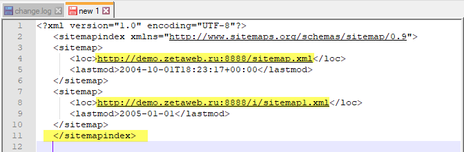

# Карта сайта \(Sitemap\)

Термин "Карта сайта \(Sitemap\)" в рамках системы Zeta Web имеет два значения:

* Автоматически генерируемый файл sitemap.xml \([для поисковых систем](https://ru.wikipedia.org/wiki/Sitemaps)\)
* Контрол [SEO. Карта сайта](../../tekhnicheskaya-dokumentaciya/opisanie-kontrolov/5-seo/seo-karta-saita.md), который позволяет выводить иерархию страниц.

## Для поисковых систем

### Автоматически генерируемый файл sitemap.xml

Zeta Web автоматически создает xml-файл sitemap.xml по адресу _http\(или https\)://domain-name/sitemap.xml \(например, https://www.zetasoft.ru/sitemap.xml\)._

При формировании используется следующий формат:

```markup
<urlset xmlns="http://www.sitemaps.org/schemas/sitemap/0.9">
    <url>
        <loc> URL страницы (например, https://www.zetasoft.ru/products-zetaweb/) </loc>
    </url>
    ...
    <url>
        <loc> URL страницы </loc>
    </url>
</urlset>
```

В файл попадают все ссылки на страницы, которые [не скрыты](../menyu-karty-ssylki/dobavlenie-stranicy-v-kartu-saita.md#skryvat-ili-otobrazhat) для карты сайта и принадлежат выбранной в домене группе.


### Добавление других файлов \*.xml

~~Также можно добавлять другие файлы с форматом xml, созданные вручную. Такие файлы подключаются в robots.txt.~~

Для добавления нескольких страниц в карту сайта требуется:

1\) Создать xml-файл _**sitemapindex.xml,**_ внутри которого следует прописать домен \(файл _sitemap.xml_, который генерирует Zeta Web\);


Более подробно с информацией о файле sitemapindex.xml Вы можете ознакомиться по ссылкам на сайты [https://support.google.com/webmasters/answer/75712?hl=ru](https://support.google.com/webmasters/answer/75712?hl=ru) и [https://www.sitemaps.org/protocol.html\#index](https://www.sitemaps.org/protocol.html#index).




2\) Сгенерировать карту сайта с N-количеством ссылок \(например, _sitemap1.xml_\);

3\) Загрузить файл на сайт посредством **1С→Управление сайтом→**вкладка **Наименование сайта→**вкладка **Картинк**и→папка **Разное** добавить основной файл ****_**sitemapindex.xml**_**,** а также дополнительную карту _**sitemap1.xml.**_ 

4\) Открыть загруженные xml-файлы и **получить ссылку**, путем нажатия на соответствующую кнопку;


5\) Сообщить поисковой системе о наличии xml-файлов посредством robots.txt.

### Robots.txt

Для того, чтобы сообщить поисковой системе о наличии xml-файлов необходимо открыть **1С→Управление сайтом**→вкладка **Настройки**→вкладка **Домены**→вкладка **Наполнение robots.txt.** 

При этом можно указать путь к sitemap как к основному файлу _**sitemapindex.xml**_, так и к каждому из файлов в отдельности.


