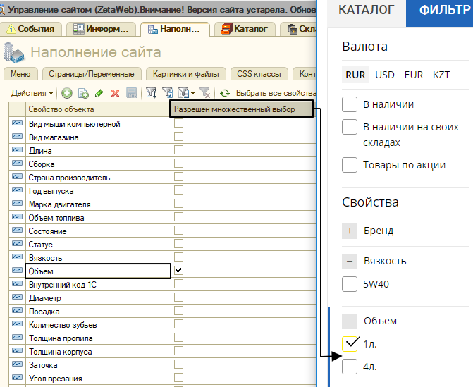

# Карта сайта \(Sitemap\)

Термин "Карта сайта \(Sitemap\)" в рамках системы Zeta Web имеет два значения:

* Автоматически генерируемый файл sitemap.xml \([для поисковых систем](https://ru.wikipedia.org/wiki/Sitemaps)\)
* Контрол [SEO. Карта сайта](../../tekhnicheskaya-dokumentaciya/opisanie-kontrolov/5-seo/seo-karta-saita.md), который позволяет выводить иерархию страниц.

## Для поисковых систем

### Автоматически генерируемый файл sitemap.xml

Zeta Web автоматически создает xml-файл sitemap.xml по адресу _http\(или https\)://domain-name/sitemap.xml \(например, https://www.zetasoft.ru/sitemap.xml\)._

При формировании используется следующий формат:

```markup
<urlset xmlns="http://www.sitemaps.org/schemas/sitemap/0.9">
    <url>
        <loc> URL страницы (например, https://www.zetasoft.ru/products-zetaweb/) </loc>
    </url>
    ...
    <url>
        <loc> URL страницы </loc>
    </url>
</urlset>
```

В файл попадают все ссылки на страницы, которые [не скрыты](../menyu-karty-ssylki/dobavlenie-stranicy-v-kartu-saita.md#skryvat-ili-otobrazhat) для карты сайта и принадлежат выбранной в домене группе.


### Добавление других файлов \*.xml

Для добавления нескольких файлов sitemap требуется:

1\) Создать другие xml-файлы sitemap;

2\) Загрузить файлы на сайт через **1С → Управление сайтом → Наполнение сайта →** **Картинки.**

3\) Открыть загруженные xml-файлы и **получить ссылку**, путем нажатия на соответствующую кнопку;


4\) Сообщить поисковой системе о наличии xml-файлов посредством **robots.txt.** Для этого необходимо открыть **1С → Управление сайтом** → **Настройки** → **Домены** → **Наполнение robots.txt** и заполнить в поле путь к каждому из файлов. ****


### **sitemapindex.xml**

Другим способом для добавления нескольких страниц sitemap является создание основного файла индекса sitemap, где будут прописаны пути к остальным файлам.


Более подробно с информацией о файле **sitemapindex.xml** Вы можете ознакомиться по ссылкам на сайты [https://support.google.com/webmasters/answer/75712?hl=ru](https://support.google.com/webmasters/answer/75712?hl=ru) и [https://www.sitemaps.org/protocol.html\#index](https://www.sitemaps.org/protocol.html#index).


Для этого необходимо создать файл _**sitemapindex.xml**_, пример, которого представлен ниже:

```text
<?xml version="1.0" encoding="UTF-8"?>
   <sitemapindex xmlns="http://www.sitemaps.org/schemas/sitemap/0.9">
   <sitemap>
      <loc>http://demo.zetaweb.ru:8888/sitemap.xml</loc>
      <lastmod>2004-10-01T18:23:17+00:00</lastmod>
   </sitemap>
   <sitemap>
      <loc>http://demo.zetaweb.ru:8888/f/sitemap1.xml</loc>
      <lastmod>2005-01-01</lastmod>
   </sitemap>
   </sitemapindex>
```

Через **1С → Управление сайтом → Наполнение сайта → Картинки** добавить основной файл ****_**sitemapindex.xml**_ ****на сайт. 

Открыть загруженный xml-файл и **получить ссылку**, путем нажатия на кнопку **"Просмотр"**

Затем в **1С → Управление сайтом** → **Настройки** → **Домены** → **Наполнение robots.txt**  будет необходимо указать лишь путь к основному файлу _**sitemapindex.xml**_.



