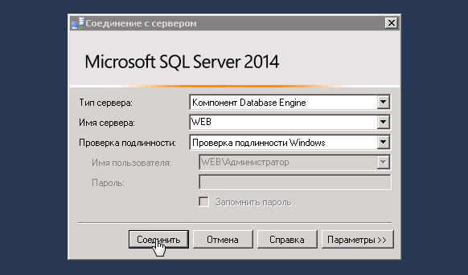
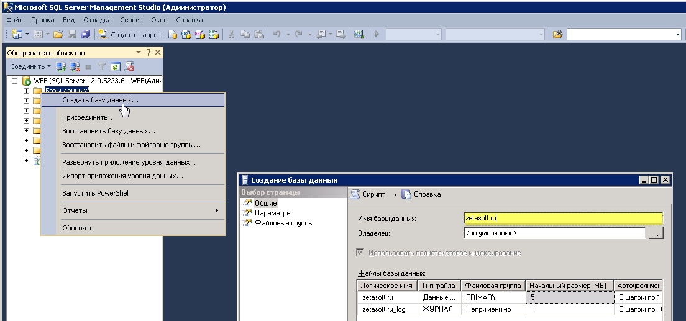

# Установка и обновление веб-части

## Установка веб-части

Первичная установка продукта требует ряда специализированных знаний и может быть выполнена самостоятельно при условии наличия определенной квалификации.

На сервере, где размещается ваш сайт, должен быть установлен IIS версии 7.0 и выше, .NET Framework версии 4.6.2 и выше, .NET Core Runtime 3.0.1 Hosting Bundle и выше, а также, должен быть доступен дистрибутив Zeta Web на одном из локальных дисков.

### Создание базы данных (далее - БД) сайта

Для создания базы необходимо выполнить следующую последовательность действий:

* Создайте чистую БД для сайта в MS SQL

Для этого запустите _**Microsoft SQL Server Managment Studio**_



В левой части панели открывшегося окна, нажав правой кнопкой мыши на папку **Базы данных** необходимо выбрать **Создать базу данных,** а в поле **Имя базы данных** внести наименование сайта.




* Восстановить созданную БД из резервную копию БД релиза (файл расположен в каталоге DB дистрибутива с именем в формате x.x.x.x.bak»)


Динамический контент приводит к фрагментации таблиц БД, что, в свою очередь, прямо влияет на производительность сайта.&#x20;

Для поддержания производительности, а также для обеспечения сохранности данных в случае технического сбоя следует:

* Настроить регламентные операции по дефрагментации и реиндексации таблиц БД и таблиц статистик ([пример листинга таких операций приведен в разделе «Техническая документация»](../reglamentnye-operacii.md))
* Настроить план обслуживания по архивному копированию БД


### Размещение файлов сайта и настройка IIS

Для развертывания файлов сайта необходимо:

* Создать сайт в панели Диспетчер служб IIS (в пуле должно быть выбрано .NET FrameWork, версии 4.0)
* Разместить в папке сайта файлы из папки **cms** в поставке, дать на них доступ на изменение для пользователя «IIS\_IUSRS» на закладке Безопасность добавить пользователя и установить флаг Полный доступ.
* В созданном сайте (IIS) сконвертировать в приложение каталог **transferservice**, представляющую собой сервис обмена: -преобразовать в приложение


Как правило, рекомендуется использовать отдельный пул для сервиса обмена сайта _(например, создать отдельный пул "+exchange" к его имени)_


* Перенести в корневую папку из папки configs файлы:
  * WebConnection.config
  * WebSettings.config
* Прописать в файле «WebConnection.config» пути доступа к SQL-базе сайта
* Заполнить bindings именами доменов: - если их несколько
* Перезапустить сайт

После выполненных действий необходимо перейти в 1С, установить [настройки параметров обмена с сайтом](nastroiki-saita-posle-zagruzki-nachalnykh-dannykh-i-tipovogo-dizaina.md) и произвести выгрузку данных.

### Установка API 2.0

* Скачать и установить с официального сайта microsoft .NET Core Hosting Bundle версии 3.0.1 и выше ([https://dotnet.microsoft.com/download/dotnet-core](https://dotnet.microsoft.com/download/dotnet-core))

.png>)

* Открыть файл **WebSettings.config** в корневом каталоге приложения и добавить в конец файла следующую строку:&#x20;

```
<add key="ApiUrl" value="/core" />
```


В качестве значения атрибута **value** можно указать относительный или абсолютный путь к каталогу API 2.0. В приведенном примере указан относительный путь к каталогу API 2.0 по умолчанию: /core.


* Сохранить изменения в файле **WebSettings.config**

.png>)

* Добавить в каталог /core файл **connectionStrings.json**, в теле которого разместить следующий текст:&#x20;

```
{
  "ConnectionStrings": {
    "ZetaWebInfrastructureDbContext": "Server=SSS;Database=DDD;Integrated Security=False;User Id=UUU;Password=PPP;MultipleActiveResultSets=true;"
  }
}
```


Замените следующие параметры в указанном примере:

* **SSS** - адрес сервера БД
* **DDD** - имя базы данных сайта
* **UUU** - имя пользователя сервера БД
* **PPP** - пароль пользователя БД.


* Сохранить изменения в файле **connectionStrings.json**

.png>)

* Открыть файл **web.config** в каталоге **/core** и добавить (либо отредактировать последний параметр с 1200 до 6000) строку перед тегом \</system.webServer> следующую строку:

```
<aspNetCore processPath=".\Zeta.Web.Api.exe" stdoutLogEnabled="false" stdoutLogFile=".\logs\stdout" hostingModel="inprocess" startupTimeLimit="6000" />
```

* Создать новый Пул приложений (Application Pool) как указано на картинке ниже

.png>)

* В созданном сайте (IIS) сконвертировать в приложение каталог **core**

.png>)

* Указать в создаваемом приложении ранее созданный пул приложений

.png>)

* Удостовериться, что в дополнительных параметрах пула приложений запрещены 32-х разрядные приложения:&#x20;

.png>)

* Перезапустить сайт
* Открыть описание API 2.0 для проверки правильности настроек по адресу: **имя\_вашего\_сайта/core/docs/index.html**

.png>)


Если что-то пошло не так...

После старта приложения в  каталоге /core/logs будет доступен файл с наименованием в формате yyyy-MM-dd.log. \
В данном файле содержатся описание процесса запуска приложения.J,y


## Обновление веб-части

1. Сделать бэкап файлов сайта. Для этого заходим в каталог сайта (например, нажимаем правую кнопку мыши на сайте в IIS, выбираем "Проводник" и попадаем в каталог нашего сайта.
2. Определить текущую версию файлов приложения. &#x20;


Посмотреть текущую версию приложения можно в файле **ChangeLog.txt**, расположенном корневой директории приложения.


3\. Выделить все содержимое папки, исключаем следующие каталоги:

* App\_Data
* FilesCache
* ImagesCache
* logs
* Prices
* ReferencesCache\
  и файл log.xml

4\. Архивировать выбранные файлы, задаем значимое имя (пример формата: имя сайта + номер версии приложения + дата архивации)

5\. Перевести сайт в оффлайн для внешних пользователей и поисковых систем. Для этого изменяем имя файла \_app\_offline.htm, убирая первое подчеркивание. \
Теперь сайт будет отображать информацию из этой страницы.

6\. Сделать бэкап базы данных сайта средствами SQL. С информацией по формированию бэкапа можно ознакомиться на сайте производителя СУБД.\
[https://docs.microsoft.com/ru-ru/sql/relational-databases/backup-restore/create-a-full-database-backup-sql-server?view=sql-server-ver15](https://docs.microsoft.com/ru-ru/sql/relational-databases/backup-restore/create-a-full-database-backup-sql-server?view=sql-server-ver15)

7\. Скопировать на веб-сервер дистрибутив нового приложения. Внутри дистрибутива располагаются две папки - CMS и DB.

8\. Заменить файлы приложения, расположенные в каталоге нашего сайта, на файлы, расположенные в папке **CMS.**

9\. Перевести сайт в рабочий режим - обратно добавляем первое подчеркивание у файла app\_offline.htm - он снова становится \_app\_offline.htm.

10\. Для версий 2.4 и выше запустить сервис "core" в браузере для применения миграций: **имя\_вашего\_сайта/core/docs/index.html**

11\. Перезапустить сайт. Открываем главную страницу и дожидаемся её отображения.


Изменения базы данных требуемые для работы нового релиза будут применены в автоматическом режиме.



**Важно!** Если изменения не применились, основная страница сайта не открылась - как правило, это признак проблем при обновлении. \
Наиболее часто они связаны с некорректными значениями в таблицах базы данных или настройками IIS. \
В этом случае рекомендуется скопировать описание ошибки, восстановить сайт из бэкапов и обратиться к специалистам.


### Дополнения к основным инструкциям

#### 2.4.10.1

При обновлении на релиз 2.4.10.1 и выше необходимо выполнить установку и настройку приложения API 2.0 (см. инструкцию по установке)

#### **2.4.11.0**

Перед обновлением на релиз 2.4.11.0 и выше на веб-сервере необходимо установить .NET Core Hosting Bundle версии 3.0.1 или выше ([https://dotnet.microsoft.com/download/dotnet-core/3.0](https://dotnet.microsoft.com/download/dotnet-core/3.0))

#### **2.5.0.0**

При обновлении на этот релиз необходимо заново перевыпустить лицензию на использование функциональности сайта.\
Для перевыпуска необходимо предоставить файлы лицензии (располагаются в каталоге вашего сайта в папке license) в компанию ЗетаСофт.

**2.5.1.1**

Перед обновлением веб-части на релиз 2.5.1.1 и выше необходимо установить следующие серверные компоненты:

* Microsoft Net Core 5.0.0 Windows Server Hosting
* Microsoft Net Runtime 5.0.0 (x86)
* Microsoft Net Runtime 5.0.0 (x64)

**2.6.0.0**

Перед обновлением веб-части на релиз 2.6.0.0 и выше требуется установить [Microsoft Framework 4.8](https://support.microsoft.com/ru-ru/topic/microsoft-net-framework-4-8-%D0%B0%D0%B2%D1%82%D0%BE%D0%BD%D0%BE%D0%BC%D0%BD%D1%8B%D0%B9-%D1%83%D1%81%D1%82%D0%B0%D0%BD%D0%BE%D0%B2%D1%89%D0%B8%D0%BA-%D0%B4%D0%BB%D1%8F-windows-9d23f658-3b97-68ab-d013-aa3c3e7495e0). Установка этого пакета потребует перезагрузки хостинга.&#x20;

Для корректной работы функционала рассылки прайс-листов потребуется изменить относительный путь в разделе price list settings файла WebSettings.config на полный.

```
Было:
<add key="ApiUrl" value="/core"/>

Стало (пример):
<add key="ApiUrl" value="https://вашсайт.ru/core"/>
```
